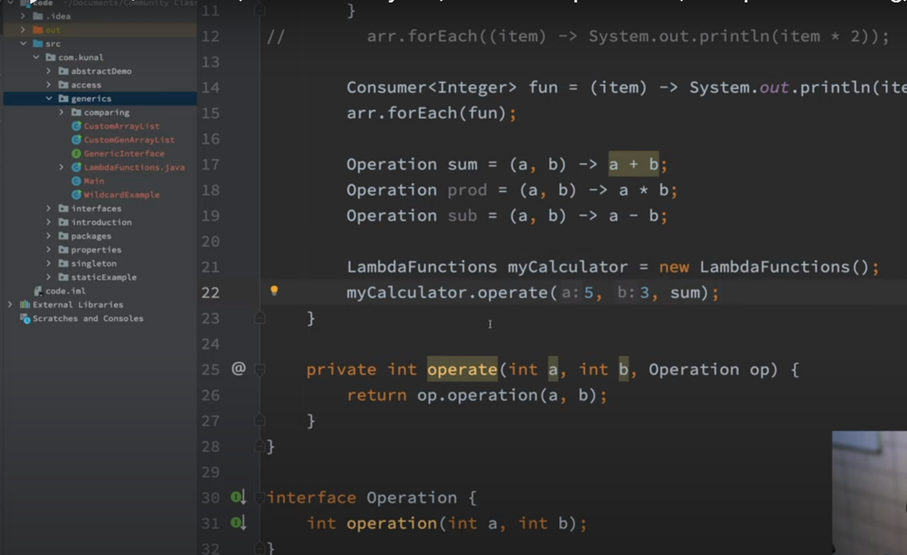
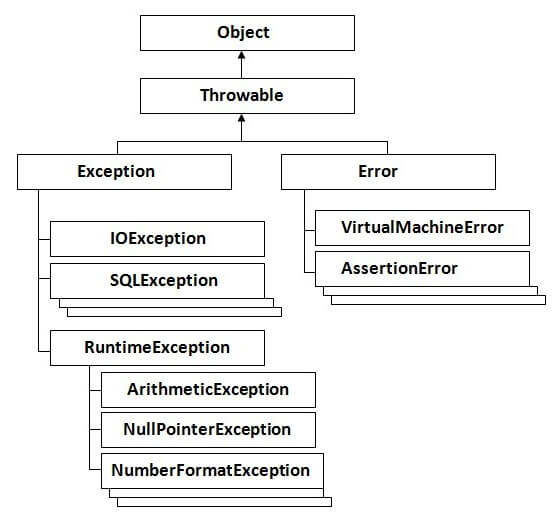
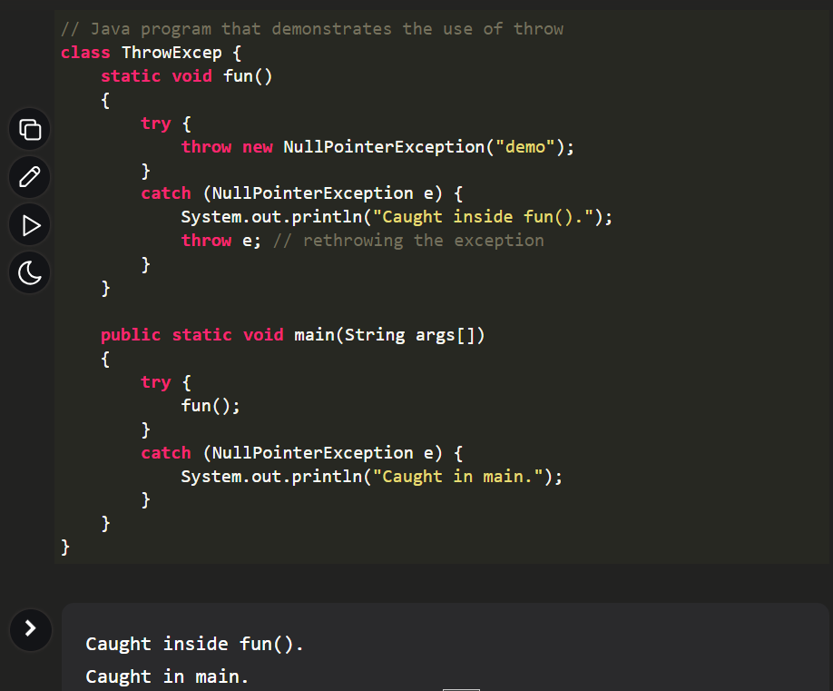

# Notes : Core Java Execution and Basics

https://github.com/kunal-kushwaha/DSA-Bootcamp-Java/tree/main/lectures

## Fundamentals
Programming languages and thier way of interacting with computer
1. Procedural
2. Functional
3. Object-oriented

Java language follows all of these approches. Java is a static programming laguage, meaning it gives more control to the developer to specify all the things before hand. Java is still widely used in the industry. It is robust and it can take huge load at any given point of time.  Java is platform independent

Java is both interpreted and compiled programming language. To develop and work in Java you need JDK
JDK consists of JRE which has JVM Along with some additional file required by JVM.

1. In java everything has to be written inside a class
2. Files that have java code are saved with .java extention
3. First the human understandable source code is compiled by compiler and is converted into bytecode.  using javac <filename.java>  it is converted to <filename.class>
4. This byte code is the real platform independent thing. The byte code is then interpreted by interpreter present in JVM.
5. The JVM is present inside JRE.

5. Memory is managed by jvm itself by the process of garbage collection
6. The conputer memory is devided in two parts. Stack and Heap. The variables/ ref variables are stored in stack and the actual object is created in heap
7. GC clears out memory in heap.
8. when a class say Demo is public class, then it should be declared in a separate file. meaning any inner class cannot be public class.
9. Explain PSVM and SOPLn.

Type Casting and Type Conversion
Type casting between two datatypes can happen only when following conditions are met
1. The two types must be compatible
2. The destination type should be greater than the source type

===================================================================================================================

## OOPS Fundamentals
https://github.com/kunal-kushwaha/DSA-Bootcamp-Java/tree/main/lectures/17-oop/notes

**Class :** a Class is a logical construct. It is kind of a stencil or casket based on which objects are created.

**Objects:** Object is an instance of a class. Like as I said class is a stencil, so object is something that is created using that stencil. Objects exists physically.
Instance Variables: vars defined inside an object, whose scope is limited to that particular obkect only are called instance vars
ref-variables: vars named used for objects.

Significance of "new" keyword >When we create any instance of a class, we create an object, this new keyword is used in scenario where we want to create a totally new object. it calls the constructor of class to create objects

Student s = new [constructor of Student Class]

**Pass by value:** Java is pass by value and not pass by reference, because when you use any method and pass a variables as input to it, only the value of the variable is taken into consideration and operations as performed on this given value, once the method execution is completed if you compare the variable passed and value of the output there may or may not be difference based upon method body, but one thing worth noticing is the memory address of both the vars that we are talking about would be different. this proves java is pass by reference

**this keyword :** In Java this keyword points to the current object under consideration. The object on which any operation is being performed, for example if you are creating an object of a class then, while defining the params of this object, you pass values to constructor at that point, parameterised constructor is called which handles definition of variables and params for current object which is being defined, and all of this is being done using the this keyword

ex:
Student sumegh = new Student( 14, "Sumegh T", 98.09f)  then interanally it would be working as

     Student(Integer rNo, String name,  Float percentage) {
		this.rNo = rNo; 
		this.name = name; 
		this.percentage = percentage; 
	}
	
===================================================================================================================

## Garbage collection and finalize:
GB is an automatic process, managed by JVM. After any operation when a good amount of memory is utilized, the  JVM hits GC method, this first checks for objects that are unreferenced or idle. say the objects that are there in heap mem, but no ref variable is pointing to it, such things will be cleared.

As stated earlier it is automatic process you do not have any control over it, but there could be certain operations or tasks that you would want to execute before your ibject is destroyed, you can put those operations in finalize

**Note:** Hashcode is not an address of object

## Access mods:
* public
* protected
* private

### Static : 
static methods do not need objects of a class to be created. Static vars/ methods are object independent. hence you cannot/ must not use this keywords inside constructor or methods to reference static things, use the class name instead.

### static block:
When a class is loaded by the compiler, then static objects /methods are the very first thing that are evaluated.
Note: Static vars or methods are not object depended, and are called class level entities . You cannot have a non static member inside a static method.

A static block is executed only once.
static {
int a = 4;
}

### SingleTon class:
When only one object of a class can be created.
steps to do this
1. Set the constructor as private
2. initialize a private object of that class, within itself
3. create a static method which can be called from other places that will check if an object exist,  will create if not and will then return the only object created for this class.

===================================================================================================================

## OOPs Pillars

**Inheritance**
1. Single Inheritance: when One class is extended by another child class.
2. Multilevel , when one class B, which extendsba class A is now extended by new child class C.
3. Multiple inheritance not supported in Java, but it can be achieved by using interfaces.
4. Hierarchial inheritance: When one class is inherited by multiple child classes
5. Cyclic inheritance: is not supported
6. Hybrid inheritance: involves mix of multiple inheritance, hence not supported in java.

- By default all class are extending obbject class.  When One class B extends a class A, then B has access to the methods and variables defined in A, which are not private. Also B can override methods in A.
- if we create an Object like
-  A obj = new B (), here the ref variable is of type A and hence determines what type of methods and vars object can access, meaning only the vars and methods in A, but suppose if a method in A is overriden in B then, if we call such method, the impl in B will be executed. by a phenomenon called dynamic method dispatch
-------------------------------------------------------------------------------------------------------------------------------------
**Polymorphism**
Meaning many ways to represent.
Static polymorphism, compile time poly, is when a method is overloaded, meaning when the params of a method are different. or at least order of params is different. method name should be same here.

Dynamic poly, runtime poly, is when a method is overridden. In this case, Same method name, same params but operation is different, at may be return type.

Final key word, Final methods cannot be overridden, this means, when a final method is called, the compiler will call the byte code of this method, no matter how many time you make a call to it, and since there is no change, it increases execution efficiency and makes execution faster

If you make constuctor of a class as Final, the class cannot be extended (inherited)
static method cannot be overridden because, static methods are object/instance independent, so there is no point to make any change.

Overriding depends on object, Static does not depends on object, Hence STATIC CANNOT BE OVERRIDEEN

--------------------------------------------------------------------------------------------------------------------------------------------------------
**Encapsulation:**
Wrapping up of implementation of variables, methods and components  in a class. Hiding internal impl of a class and its data members.
Example

-------------------------------------------------------------------------------------------------------------------------------------
**Abstraction:**
Giving flexibility to the child classes to implement existing methods based upon use case. Abstract methods do not have a body. Showing only the required information.
- If a class contains, one or more Abstract method, the class has to be made abstract.
  public abstract class Parent( )  {  
  abstract void  career(String name);
  }

- abstract classes can have variables, but what could be significance, since the method do not have a body
- Consider this example, Assume that there is a an abstract class vehicle, which has abstract run () method, which is being overridden in various vehicle as per the design and specification. Now if the govt lays new rules like BS6 vehicle have to keep 2L fuel in reserve, then this property will be directly inherited in each child class automatically. Means, it reduces overhead of child classes to implement variables explicitly if they all have some property in common

- You cannot create, Object of an abstract class, why because if the method is abstract, and you if you try to call this method through an object, how will it implement?..
- Constructors cannot be abstract, yet abstract classes have constructor, why ?, because if there are variables in abstract class, and you want to update the default value of that variable in any of a child class, then you can do that !.

**Interface:**
- An interface is a completely "abstract class" that is used to group related methods with empty bodies.
- interface, is kind of a contract that binds any class which sign it to provide implementation to all its member method, why because interfaces contain abstract method only. Also any class can implement more than one interface
- members of an interface are public by default
- and variables are default static and final
- it is a file that is with .java extension same like class. Multiple inheritance can be achieved in a kind, because one class can implement multiple interfaces. Also resolution of methods  in interface (dynamic look up of methods) happen on runtime only, as a result they have a performance impact. Hence we should not use it causally in performance critical code

Can I implement a Java interface method as private or protected?

- No you cannot because there are some rules(more details are mentioned here) :
- In java, a method can only be written in Subclass, not in same class.
- The argument list should be exactly the same as that of the overridden method.
  The return type should be the same or a subtype of the return type declared in the original overridden method in the super class.
- The access level cannot be more restrictive than the overridden method’s access level. For example: if the super class method is declared public then the over-ridding method in the sub class cannot be either private or protected.
- Instance methods can be overridden only if they are inherited by the subclass.
- A method declared final cannot be overridden.
- A method declared static cannot be overridden but can be re-declared.
- If a method cannot be inherited then it cannot be overridden.
- A subclass within the same package as the instance’s superclass can override any superclass method that is not declared private or final.
- A subclass in a different package can only override the non-final methods declared public or protected.
- An overriding method can throw any uncheck exceptions, regardless of whether the overridden method throws exceptions or not.\
- However the overriding method should not throw checked exceptions that are new or broader than the ones declared by the overridden method. The overriding method can throw narrower or fewer exceptions than the overridden method.
- Constructors cannot be overridden.
- Classic examples of interface is Serializable, Comparable, Comparator

## comparable vs comparator :
https://www.javatpoint.com/difference-between-comparable-and-comparator
https://www.baeldung.com/java-comparator-comparable

- class Student implements Comparable<Student>{  
  public int compareTo(Student st)   {  
  if(age==st.age)  
  return 0;  
  else if(age>st.age)  
  return 1;  }
  }

------------------------------------------------------------------------------
Similarly 

class Student implements Comparator
public int compare(Student old_st, Student new_st)   {  
if(old_st.age==new_st.age)  
return 0;  
else if(old_st.age>new_st.age)  
return 1;  }
}

When to Use Which:

1. Use Comparable when you want to define the default natural ordering of objects in a class. For example, if there is a clear, intrinsic way to order objects (like sorting integers or strings), implement Comparable.
2. Use Comparator when you want to provide multiple sorting strategies for a class or when you want to sort objects based on criteria that are not intrinsic to the class. This allows you to sort objects in different ways without modifying the class itself.
3. In summary, if you control the class and want to define the default way of sorting its objects, implement Comparable. If you want to provide different ways to sort objects of a class without modifying the class itself, use Comparator.

===================================================================================================================

**Serializable:**
- Serializable is a marker interface (has no data member and method). It is used to "mark" Java classes so that the objects of these classes may get a certain capability. The Cloneable and Remote are also marker interfaces.
- The Serializable interface must be implemented by the class whose object needs to be persisted.
- The String class and all the wrapper classes implement the java.io.Serializable interface by default.
- Let's see the example given below: https://www.javatpoint.com/serialization-in-java

## Lambdas, Streams and Functional Programming

Lambda functions are oneline functions (short hand functions). Kind of abstract methods that are overridden in your main code
  

## Exception Handling
The object class is extended by Throwable, which is the root of exception handling.
  

Error: When programs encounter an issue and terminate. The state of a program cannot be retained after an error is encountered.

Exception: when the normal flow of your code/ program meets with an unexpected hurdle. Which can be handled
1. Exception can be either **Checked Exception** (Compile time exception) or **Unchecked Exception** (Runtime exception).
2. To throw an exception explicitly through a method, you have to mention in the method signature that the method throws Exception.

  `static void doSomething(int a, int b) throws ArithemeticException {
  }`

3. To handle this make use of a try-catch block, try block tries to execite a particular operatn and if any error is encountered then it is
   addressed in the catch block. the code written in finally block would execute no matter what. We can put closer of resource, in this block. 

  

## Object Clonning
1. When we try to create one object from another using new keyword like as shown below
`    A a = new A(x, y);
     A b = new A (a);`
   a clone named 'b' of object 'a' is created using 'new' and this takes a lot of processing time. All of this can be reduced object clonning
2. To perform obkect cloning java.lang has a package has an interface called Cloneable
3. Here Shallow copy is created by default. To make a deep copy, you have to override clone method from object class. 

**Next Topic Collection FrameWork and Generics**

